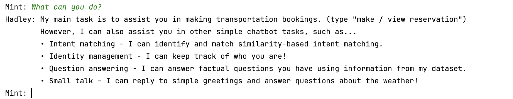

<a id="readme-top"></a>

<!-- PROJECT TITLE -->
# Transportation Booking Chatbot
An NLTK based AI chatbot system for booking transportation and small talk engagement.

<!-- TABLE OF CONTENTS -->
<details>
  <summary>Table of Contents</summary>
  <ol>
    <li>
      <a href="#about-the-project">About The Project</a>
      <ul>
        <li><a href="#built-with">Built With</a></li>
      </ul>
    </li>
    <li><a href="#usage">Usage</a></li>
  </ol>
</details>

<!-- ABOUT THE PROJECT -->
## About The Project



This project is an interactive NLP-based system that utilises NLTK to develop a chatbot without any large language model APIs.

The project emphasises on two aspects:
1) Conversational design such as discoverability, prompt design and error handling
2) Chatbot functionalities including intent matching, information retrieval & question answering, and transactions (booking service).

Refer to [```Project_Report.pdf```](Project_Report.pdf) for the full documentation of this project, including the usage of text vectorisation to calculate similarity matching, and the training of classifier to predict sentiment of user responses.

As this project is part of a university module assessment, feedback from the module convenor is included below:

> Report: Both architecture and conv. design are very well described, and no improvement are needed of the description of functionality, implementation, and justification. Everything is very well explained and justified, using a sufficient amount of detail, with a good use of code examples, text examples, and diagrams where necessary. More flowcharts could have been nice to illustrate each function of your chatbot, since you did not provide examples for all of them. Both usability and performance testing are very good, there is no need for any improvement. Good testing protocol and good job at reporting insights gained through this evaluation. The discussion effectively reflects on the results of the evaluation and the project and there is no need for improvements. Very good discussion section. You properly and thoroughly discussed your results and contextualised the numbers with the actual user experience. Writing quality is comparable to a peer-reviewed research paper. The presentation is very good. The paper is well-written, using clear language, making good use of diagrams and illustrations to explain things. You have an appendix section which makes sense, and contains the type of information I'd expect to see in an appendix.
> 
> System: The architecture is very good, exceeding expected features, and following good coding practices throughout. Well designed system. Well-commented and nicely engineered. Your matching system was cleverly designed and made good use of different approaches and their respective strengths. Conversational principles have all been implemented very well. Very good implementation of the conversational design principles.

### Built With

* [](https://www.python.org/)
* [](https://www.nltk.org/)

<p align="right">(<a href="#readme-top">back to top</a>)</p>

<!-- USAGE -->
## Usage

Download the ```src``` folder and run on any python environment. NLTK installation is required as prerequisite.

<p align="right">(<a href="#readme-top">back to top</a>)</p>